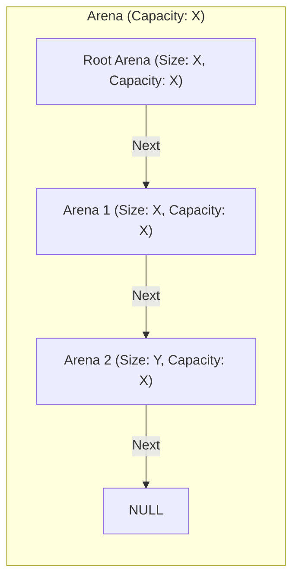

# Cosmic Arena Allocator
 High performance Arena allocator for C#. Say good bye to Garbage collector. 

### Usage

### Install
* Via Nuget Package Manager
* Via Command Line
     ```
     dotnet add package CosmicAllocator
     ```


#### Creating an Arena

```cs
    //allocate 1024 bytes in arena.
    using Arena arena = ArenaManager.Create(1024);  // auto disposed after exiting current block
```
or go unsafe

```cs
    Arena* arena = ArenaManager.CreatePointer(1024);
    ...
    arena->Dispose(); // make sure to dispose arena in this case
```

<b>Note!!!</b>
this will be capacity of arena, if this arena is fully utilized,
     new arena will be created with same capacity.
 
    
#### Allocating Memory

```cs
Span<int> span = arena.Alloc<int>(10); // Allocates space for 10 integers

Span<Point> pointsSpan = arena.Alloc<Point>(10); // Allocate 10 Points object on arena, Here Point is a Struct

struct Point(int X,int Y);

```

or go unsafe

```cs
int* memory = (int*)arena.Alloc(40); // Allocates 40 bytes
```

#### Retrieve the Memory of any given Arena
```cs
Span<int> ints = arena.AsSpan<int>(); // retrives memory as Span of int

//read write values in span
var value = ints[0];
ints[0] = 20;

arena.AsSpan<Point>(); // retrives memory as Span of Point
```

<b>Note!!!</b>
Above code doesn't retrieve the memory of all nested arena, it only returns current arena's memory.

#### Retrieve the Memory of all the Arena's nested

```cs
 void IterateAll()
 {
     ArenaSafeHandle currentArenaHandle = arena.CurrentHandle;

     do
     {
         var intSpans = currentArenaHandle.DataRegion.AsSpan<int>(); // read all memory block as Span
        //do anything with span data of a given Arena
        foreach (int i in intSpan)
        {
            Console.WriteLine(i);
        }

         //Proceed to next Arena node to read it also
         currentArenaHandle = currentArenaHandle.NextHandle;
     }
     while (currentArenaHandle != ArenaSafeHandle.Zero);
 }
```

or go unsafe

```cs
public unsafe void IterateAllMemory()
{
    Arena* currentArena = arena.AsPointer();

    do
    {
        var intSpan = currentArena->AsSpan<int>(); // read all memory block as Span
        //do anything with span data of a given Arena

        foreach (int i in intSpan)
        {
            Console.WriteLine(i);
        }


        //Proceed to next Arena node to read it also
        currentArena = currentArena->Next;
    }
    while (currentArena != null);
}

```

Please see the diagram below for clarity of the code.


#### Get and Set By Index item in homogenous data including all linked arena

If data type of all the allocated data is same then we can get and set item by index easily across linked arenas with 

```cs
    var item =  arena.GetItemInAll<T>(index); // here all arenas are considered to be combined so indexing will work across arenas even though the are disconnected

    arena.SetItemInAll(index,item); //similary are lined arenas are considered to be single combined

```

#### Reduce the size of a arena

```cs
arena.Reduce(10); // decrease size of Arena by 10 bytes (doesn't deallocate memory only decrement the counter)
```
    
#### No Linked Arena'a
By default as per demand new arena's will be created.
If you dont want to create new Chained Arenas make sure your total allocation is not more than capacity of Arena. 
```cs
using Arena arena = ArenaManager.Create(1024);  // auto disposed after exiting current block
void* mem = arena.Alloc(600); // Allocates space for 10 integers

//before allocation anywhere make sure
nuint newAllocationSize = 512;

if(arena.Size+newAllocationSize<=arena.Capacity)
{
    void* moreMem = arena.Alloc(600); // Allocates space for 10 integers
}

//moreMem allocation won't happen in this case as we have no memory , without this check this allocation will happen in a newly created linked Arena
```


#### Manual Memory Deallocation

Memory is deallocated automatically when with using block, manually memory can be release with 
```cs

arena.Free();
//or
arena.Dispose();

```

### Arena Allocator Architecture 



The diagram depicts the hierarchical structure of memory management using linked arenas. Each arena is represented as a node with its size and capacity specified. The relationship between arenas is shown using labeled edges, indicating the flow of memory allocation (Next). The subgraph labeled "Arena (Capacity: X)" groups all the arenas with the same predefined capacity.

### Memory Allocation
#### Memory Allocation Flow:

* Memory is allocated within the Root Arena first.
* If the Root Arena has insufficient space, the allocation request moves to the Next Arena, following the chain.
* If no space is available in any of the arenas, a new arena is created and linked as the next node in the chain.

#### Behavior of Size and Capacity:

* Size: Indicates the current amount of memory utilized within the arena.
* Capacity: Represents the total available memory within the arena.
* Each arena allocates memory linearly, starting from Size = 0 up to Size = Capacity.

### Key Scenarios

#### 1. When Size < Capacity:

The arena has available space for further memory allocation.
New memory blocks can be allocated without creating a new arena.

For example, if an arena has Size = 512 and Capacity = 1024, it can still allocate memory for up to 1024 - 512 = 512 units.

#### 2. When Size == Capacity:

The arena is fully utilized, and no further memory blocks can be allocated within it.

Any subsequent allocation request is passed to the Next Arena in the chain, or a new arena is created if the next arena doesn't exist.

### Root Arena
The Root Arena is the starting point of the chain of arenas. It is:

* The first memory block: All memory allocation begins here, and it serves as the primary entry point for all allocation requests.

* Parent of all subsequent arenas: If the root arena becomes full, it delegates allocation to its linked Next Arena.

By organizing memory in this way, the Arena allocator minimizes fragmentation, ensures efficient allocation, and supports a dynamic chain of memory blocks to accommodate varying memory requirements.